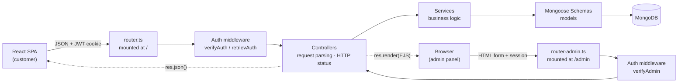
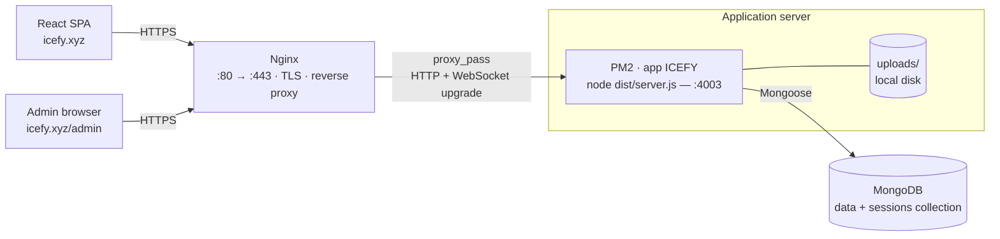
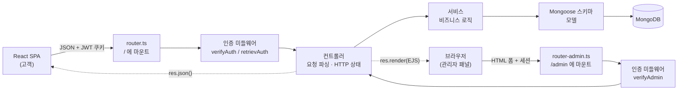
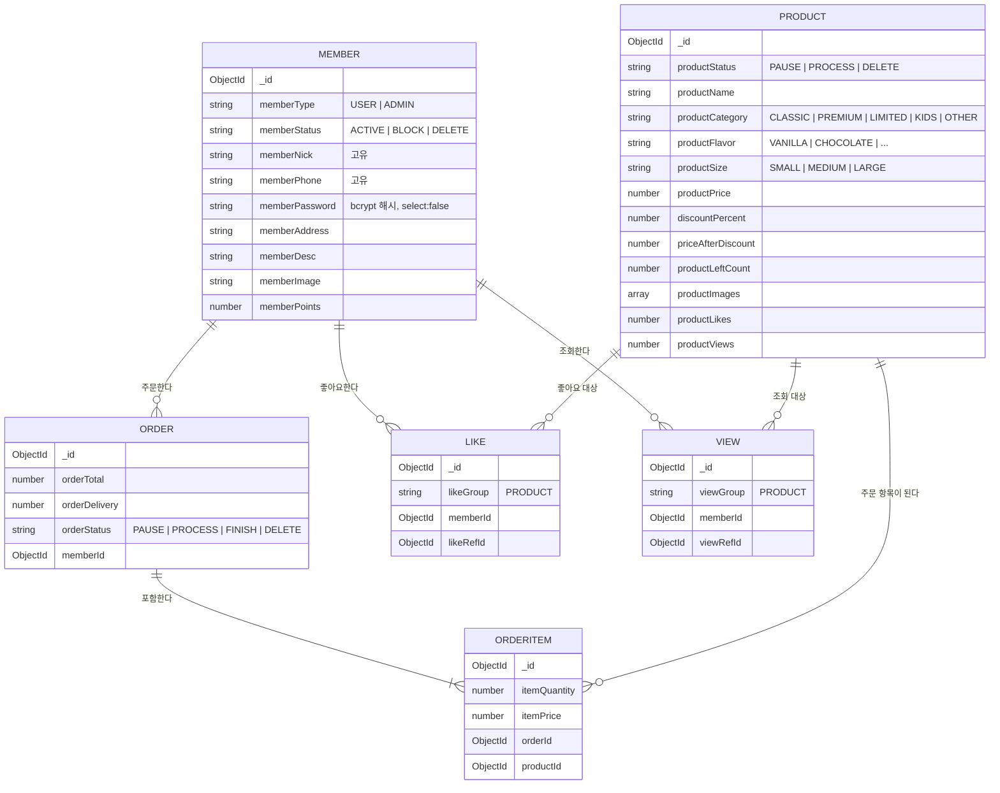
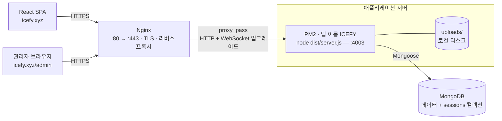

# 🍦 Icefy — Backend Server

> A production-ready Node.js / TypeScript backend for an ice-cream e-commerce platform.
> One server, two clients: a **REST API** for the React SPA and a **server-side rendered admin panel** (EJS).

<p>
  
  
  
  
  
  
</p>

**🌐 Language / 언어 —  [English](#english) · [한국어](#한국어)**

---

<a id="english"></a>

# English

## 1. Overview

**Icefy** is the backend of an ice-cream ordering service. A single Express application serves two completely different consumers at the same time:

| Consumer | Protocol | Mounted at | Auth strategy | Rendering |
|---|---|---|---|---|
| **React SPA** (customer web app) | JSON REST API | `/` | JWT in an `accessToken` cookie | Client-side (React) |
| **Admin panel** (internal tool) | HTML forms | `/admin` | `express-session` stored in MongoDB | Server-side (EJS) |

Both entry points share the same service layer and the same database, so business rules are written **once** and reused by both.

**What the system does**

- Customers sign up, log in, browse the ice-cream catalog with filtering/searching/pagination, like products, place orders, track order status, and collect loyalty points.
- Administrators log in to a separate SSR panel, create and edit products (with multi-image upload), and manage users (block / activate / delete).
- Product **views** and **likes** are logged per member so each member is counted only once, and the counters on the product document are kept in sync.

## 2. Features

- 🔐 **Dual authentication** — stateless JWT for the SPA, stateful sessions for the admin panel
- 👤 **Member management** — signup, login, profile update with avatar upload, top users by points, block/delete states
- 🍨 **Product catalog** — category / flavor / size taxonomy, search by name, sorting, pagination, discount pricing
- ❤️ **Like system** — idempotent toggle that also increments/decrements the product's like counter
- 👀 **View tracking** — one view per member per product, counted via a dedicated `views` collection
- 🛒 **Orders** — multi-item orders, automatic total + delivery-fee calculation, status lifecycle, loyalty points on payment
- 📤 **File uploads** — Multer disk storage with UUID filenames, separate folders for members and products
- ⚡ **Real-time layer** — Socket.IO server tracking live connections
- 🧱 **Layered architecture** — router → controller → service → schema, with typed DTOs and centralized error codes
- 🚀 **Production setup** — TypeScript build, PM2 cluster mode, one-command deploy script

## 3. Tech Stack

| Package | Why it is used |
|---|---|
| **express** | HTTP server, routing, middleware pipeline |
| **typescript** | Static typing across every layer (DTOs, enums, services) |
| **mongoose** | MongoDB ODM — schemas, validation, aggregation pipelines |
| **jsonwebtoken** | Issues and verifies the SPA access token (24 h) |
| **bcryptjs** | Password hashing with per-user salt |
| **express-session** + **connect-mongodb-session** | Admin panel sessions persisted in the `sessions` collection |
| **cookie-parser** | Reads the `accessToken` cookie for JWT verification |
| **multer** + **uuid** | Multipart image uploads with collision-free filenames |
| **ejs** | Server-side templates for the admin panel |
| **socket.io** | WebSocket layer for real-time client counting |
| **cors** | Cross-origin access for the React SPA with credentials |
| **morgan** | Request logging (`:method :url :response-time [:status]`) |
| **dotenv** | Environment separation (`.env` / `.env.production`) |
| **fs-extra** | Copies `views` and `public` into `dist` after compilation |
| **pm2** | Process manager, cluster mode, production restarts |

## 4. Architecture

The application follows a strict, one-directional layered flow. No layer ever skips the one below it.



**Layer responsibilities**

| Layer | Folder | Responsibility |
|---|---|---|
| **Routers** | `src/router.ts`, `src/router-admin.ts` | Map URLs to middleware chains. Nothing else. |
| **Controllers** | `src/controllers/` | Read `req.body` / `req.params` / `req.query` / `req.file`, build typed input objects, call services, translate results into HTTP responses (JSON for SPA, `res.render` for admin). |
| **Services** | `src/models/` | All business logic and database access. Throws typed `Errors`; never touches `req`/`res`. |
| **Schemas** | `src/schema/` | Mongoose models: fields, defaults, enums, indexes, timestamps. |
| **Libs** | `src/libs/` | Cross-cutting concerns — DTO interfaces, enums, error codes, config constants, the Multer uploader factory. |

**Request lifecycle example** — `POST /product/like/:id`

```
Request → cookieParser → session → morgan
        → verifyAuth (JWT → req.member)
        → likeController.likeToggle (builds LikeInput)
        → LikeService.likeToggle (delete-or-create + counter sync)
        → ProductService.productStatsEditor ($inc productLikes)
        → 200 { success, action }
```

## 5. Project Structure

```
src/
├── server.ts                  # Entry point: loads env, connects MongoDB, starts HTTP server
├── app.ts                     # Express app: static files, CORS, session, views, routers, Socket.IO
├── router.ts                  # SPA REST routes  (mounted at /)
├── router-admin.ts            # Admin SSR routes (mounted at /admin)
│
├── controllers/               # HTTP layer
│   ├── member.controller.ts   # signup, login, logout, profile, top users, auth middleware
│   ├── product.controller.ts  # SPA product queries + admin product CRUD
│   ├── order.controller.ts    # create / list / update orders
│   ├── like.controller.ts     # like toggle
│   └── admin.controller.ts    # EJS page rendering, admin session auth
│
├── models/                    # Service layer (business logic)
│   ├── Member.service.ts      # member rules for both SPA and admin
│   ├── Product.service.ts     # catalog queries, aggregations, discount logic, stats
│   ├── Order.service.ts       # order creation, order items, status + points
│   ├── Like.service.ts        # like toggle and counter synchronization
│   ├── View.service.ts        # unique view logging
│   └── Auth.service.ts        # JWT creation and verification
│
├── schema/                    # Mongoose models
│   ├── Member.model.ts
│   ├── Product.model.ts
│   ├── Order.model.ts
│   ├── OrderItem.model.ts
│   ├── Like.model.ts
│   └── View.model.ts
│
├── libs/
│   ├── config.ts              # AUTH_TIMER, morgan format, ObjectId helper
│   ├── Errors.ts              # HttpCode + Message enums, Errors class
│   ├── enums/                 # member, product, order, like, view enums
│   ├── types/                 # DTO interfaces (Member, Product, Order, Like, View)
│   └── utils/uploader.ts      # Multer factory: makeUploader("products" | "members")
│
├── views/                     # EJS templates for the admin panel
│   ├── home.ejs  login.ejs  signup.ejs  products.ejs  users.ejs
│   └── includes/header.ejs  includes/footer.ejs
│
└── public/                    # Admin panel static assets (css, js, img, videos)

uploads/                       # Runtime upload target (git-ignored)
├── members/                   # Avatars
└── products/                  # Product images

dist/                          # Build output (tsc + copied views/public)
process.config.js              # PM2 configuration (cluster mode)
deploy.sh                      # Production deploy script
extra.js                       # Copies views/ and public/ into dist/ after tsc
```

## 6. Data Model


**Collections:** `members`, `products`, `orders`, `orderItems`, `likes`, `views`, `sessions`.
All documents carry Mongoose `timestamps` (`createdAt`, `updatedAt`).

**Indexes**

- `members`: unique sparse index on `memberNick` and on `memberPhone`
- `products`: compound **unique** index on `productName + productSize + productCategory + productFlavor` — the same flavor in a different size is a different product, but exact duplicates are rejected at the database level

**Enums**

| Enum | Values |
|---|---|
| `MemberType` | `USER`, `ADMIN` |
| `MemberStatus` | `ACTIVE`, `BLOCK`, `DELETE` |
| `ProductCategory` | `CLASSIC`, `PREMIUM`, `LIMITED`, `KIDS`, `OTHER` |
| `ProductFlavor` | `VANILLA`, `CHOCOLATE`, `STRAWBERRY`, `COOKIES_CREAM`, `MANGO`, `MATCHA`, `MINT_CHOCOLATE_CHIP`, `COFFEE`, `CARAMEL`, `YOGURT` |
| `ProductSize` | `SMALL`, `MEDIUM`, `LARGE` |
| `ProductStatus` | `PAUSE`, `PROCESS`, `DELETE` |
| `OrderStatus` | `PAUSE`, `PROCESS`, `FINISH`, `DELETE` |
| `LikeGroup` / `ViewGroup` | `PRODUCT` (designed to be extended to other targets later) |

## 7. Authentication & Authorization

Two independent mechanisms coexist because the two clients have different needs.

### 7.1 SPA — JWT (stateless)

1. `POST /member/signup` or `POST /member/login` verifies credentials with `bcrypt.compare`.
2. `AuthService.createToken()` signs the member payload with `SECRET_TOKEN`, valid for `AUTH_TIMER = 24h`.
3. The token is returned in the JSON body **and** set as an `accessToken` cookie (`maxAge` 24 h).
4. On every protected request, `cookie-parser` extracts the cookie and `AuthService.checkAuth()` verifies it.

Two middlewares consume the token:

| Middleware | Behavior | Used by |
|---|---|---|
| `verifyAuth` | Token required. Attaches `req.member`; responds `401` if missing/invalid. | Profile, orders, likes, liked products |
| `retrievAuth` | Token optional. Attaches `req.member` when present, otherwise continues anonymously. | Product list & detail — lets guests browse while logged-in users additionally receive `isLiked` and get their view recorded |

### 7.2 Admin panel — Sessions (stateful)

- `express-session` with `connect-mongodb-session` persists sessions in the `sessions` collection, so sessions survive restarts and work across PM2 cluster workers.
- Cookie lifetime: **6 hours**.
- After login/signup the member object is written to `req.session.member`; a global middleware exposes it to every EJS template as `res.locals.member`.
- `verifyAdmin` allows the request only when `req.session.member.memberType === "ADMIN"`, otherwise it returns a small script that alerts the user and redirects to `/admin/login`.
- Admin signup is **single-use by design**: `processSignup` refuses to create a second `ADMIN` account.

### 7.3 Password & account safety

- Passwords are hashed with a freshly generated bcrypt salt and never returned — `memberPassword` is `select: false` in the schema and blanked before the document leaves the service.
- Login rejects `DELETE` members (`$ne` filter) and returns `403 BLOCKED_USER` for blocked accounts.

## 8. API Reference

Base URL (development): `http://localhost:4003`

### 8.1 SPA REST API (mounted at `/`)

#### Member

| Method | Endpoint | Auth | Description |
|---|---|---|---|
| `GET` | `/member/getAdmin` | — | Returns the shop's admin member (used by the SPA for shop info) |
| `POST` | `/member/signup` | — | Creates a `USER`, returns member + JWT, sets `accessToken` cookie |
| `POST` | `/member/login` | — | Authenticates, returns member + JWT, sets `accessToken` cookie |
| `POST` | `/member/logout` | JWT | Clears the `accessToken` cookie |
| `GET` | `/member/detail` | JWT | Returns the authenticated member's full profile |
| `POST` | `/member/updateMember` | JWT | Updates profile; `multipart/form-data` field `memberImage` (1 file) |
| `GET` | `/member/top-users` | — | Top 4 active users with `memberPoints ≥ 1`, sorted descending |

#### Product

| Method | Endpoint | Auth | Description |
|---|---|---|---|
| `GET` | `/product/all` | optional | Paginated catalog. Query: `order`, `page`, `limit`, `productCategory`, `productFlavor`, `search` |
| `GET` | `/product/:id` | optional | Product detail. For logged-in members also records a view and returns `isLiked` |
| `GET` | `/product/likedProducts` | JWT | Products the member has liked. Query: `page`, `limit` |
| `POST` | `/product/like/:id` | JWT | Toggles like on/off and updates the product's like counter |

#### Order

| Method | Endpoint | Auth | Description |
|---|---|---|---|
| `POST` | `/order/create` | JWT | Creates an order from an array of items; computes total + delivery fee |
| `GET` | `/order/all` | JWT | Orders of the member filtered by status. Query: `page`, `limit`, `orderStatus` |
| `POST` | `/order/update` | JWT | Changes order status; awards a loyalty point when moving to `PROCESS` |

### 8.2 Admin panel (mounted at `/admin`, SSR)

| Method | Endpoint | Auth | Description |
|---|---|---|---|
| `GET` | `/admin` | — | Renders the admin home page |
| `GET` | `/admin/signup` | — | Renders the admin signup form |
| `POST` | `/admin/signup` | — | Creates the single `ADMIN` account (`memberImage` upload required) |
| `GET` | `/admin/login` | — | Renders the login form |
| `POST` | `/admin/login` | — | Starts the admin session, redirects to `/admin/product/all` |
| `GET` | `/admin/logout` | — | Destroys the session |
| `GET` | `/admin/check-me` | — | Debug helper: alerts the current session member |
| `GET` | `/admin/product/all` | session | Renders the product management page |
| `POST` | `/admin/product/create` | session | Creates a product; `productImages` accepts up to **5** files |
| `POST` | `/admin/product/:id` | session | Updates the chosen product (status, price, discount, stock, …) |
| `GET` | `/admin/user/all` | session | Renders the user management page |
| `POST` | `/admin/user/edit` | session | Updates a user's status (block / activate / delete) |

### 8.3 Request / response samples

**Signup**

```http
POST /member/signup
Content-Type: application/json

{
  "memberNick": "icelover",
  "memberPhone": "01012345678",
  "memberPassword": "secret123"
}
```

```jsonc
// 201 Created  — the accessToken cookie is set at the same time
{
  "member": {
    "_id": "665f...",
    "memberType": "USER",
    "memberStatus": "ACTIVE",
    "memberNick": "icelover",
    "memberPhone": "01012345678",
    "memberPoints": 0,
    "createdAt": "2026-01-14T09:12:00.000Z"
  },
  "accessToken": "eyJhbGciOiJIUzI1NiIsInR5cCI6..."
}
```

**Catalog query**

```http
GET /product/all?order=createdAt&page=1&limit=8&productCategory=PREMIUM&search=mango
```

```jsonc
// 200 OK — isLiked is computed per authenticated member
[
  {
    "_id": "6660...",
    "productName": "Mango Sorbet",
    "productCategory": "PREMIUM",
    "productFlavor": "MANGO",
    "productSize": "MEDIUM",
    "productPrice": 12,
    "discountPercent": 20,
    "priceAfterDiscount": 9.6,
    "productLeftCount": 40,
    "productImages": ["uploads/products/1f0c....jpg"],
    "productLikes": 17,
    "productViews": 233,
    "isLiked": true
  }
]
```

**Create order**

```http
POST /order/create
Content-Type: application/json

[
  { "productId": "6660...", "itemPrice": 12, "itemQuantity": 2 },
  { "productId": "6661...", "itemPrice": 15, "itemQuantity": 1 }
]
```

```jsonc
// 201 Created — items sum to 39, which is under 100, so a delivery fee of 5 is added
{
  "_id": "6670...",
  "orderTotal": 44,
  "orderDelivery": 5,
  "orderStatus": "PAUSE",
  "memberId": "665f..."
}
```

### 8.4 Error format

Errors are thrown as a typed `Errors` instance and serialized directly:

```json
{ "code": 401, "message": "You are not authenticated, Please login first!" }
```

| Code | Constant | Typical cause |
|---|---|---|
| `400` | `BAD_REQUEST` | Duplicate nickname/phone, invalid discount, failed creation |
| `401` | `UNAUTHORIZED` | Missing/invalid token, wrong password |
| `403` | `FORBIDDEN` | Blocked account |
| `404` | `NOT_FOUND` | Member or product not found |
| `304` | `NOT_MODIFIED` | Update matched no document |
| `500` | `INTERNAL_SERVER_ERROR` | Unexpected failure (`Errors.standard`) |

## 9. Business Logic Highlights

These are the parts of the codebase where the real work happens.

### 9.1 Like toggle with counter synchronization — `Like.service.ts`

A single endpoint handles both liking and unliking, and the denormalized counter never drifts:

```
findOneAndDelete({ memberId, likeRefId, likeGroup })
  ├── document found    → like removed  → productStatsEditor(productLikes, −1) → { action: "deleted" }
  └── nothing to delete → like created  → productStatsEditor(productLikes, +1) → { action: "created" }
```

`productStatsEditor` is a generic helper — it takes `{ _id, targetKey, modifier }` and applies `$inc`, so the same function can drive any future counter.

### 9.2 One view per member — `Product.service.ts` + `View.service.ts`

When an authenticated member opens a product detail page, the service first checks the `views` collection for an existing `(memberId, viewRefId)` pair. Only if none exists does it insert a view log **and** `$inc` the product's `productViews`. Refreshing the page therefore does not inflate the counter, and the log itself remains available for future analytics.

### 9.3 `isLiked` computed inside the aggregation — `getProducts`

Rather than issuing N extra queries, the catalog pipeline joins the `likes` collection with a correlated `$lookup` scoped to the current member, derives a boolean, and hides the intermediate array:

```js
$lookup: {
  from: "likes",
  let: { productId: "$_id" },
  pipeline: [{ $match: { $expr: { $and: [
    { $eq: ["$likeRefId", "$$productId"] },
    { $eq: ["$memberId", { $toObjectId: memberId }] }
  ] } } }],
  as: "memberLike"
},
$addFields: { isLiked: { $gt: [{ $size: "$memberLike" }, 0] } },
$project:   { memberLike: 0 }
```

Filtering (`match`), sorting (`$sort` — ascending for `productPrice`, descending otherwise) and pagination (`$skip` / `$limit`) all happen inside the same pipeline, so MongoDB does the work instead of Node.

### 9.4 Liked-products feed — `getLikedProducts`

The pipeline starts from the `likes` collection, `$lookup`s the product, `$unwind`s it, stamps `isLiked: true`, and uses `$replaceRoot` so the endpoint returns clean product documents rather than like documents wrapping products.

### 9.5 Order creation — `Order.service.ts`

```
orderTotal    = Σ (itemPrice × itemQuantity)
orderDelivery = orderTotal < 100 ? 5 : 0     // free delivery from 100 upward
```

The order document is created first, then every item is inserted in parallel with `Promise.all` while being stamped with the new `orderId`. Orders start in `PAUSE` (cart/awaiting payment).

### 9.6 Order history join — `getMyOrders`

One aggregation returns everything the SPA needs to render an order card: match by member + status, sort by `updatedAt`, paginate, then `$lookup` the `orderItems` and `$lookup` the referenced `products` — no N+1 round trips.

### 9.7 Loyalty points — `updateOrder`

When an order transitions to `PROCESS` (payment confirmed), `MemberService.addUserPoint` performs an `$inc` on `memberPoints`, guarded so that only `USER`-type, `ACTIVE` members can accumulate points. Those points feed the `/member/top-users` leaderboard.

### 9.8 Discount pricing — `Product.service.ts`

`discountPercent` is validated to the range 0–100 on both create and update, and `priceAfterDiscount` is derived server-side (`price − price × percent / 100`). On update, when the price is not part of the payload the current price is loaded from the database first, so a discount can be applied without resending the price.

### 9.9 File uploads — `libs/utils/uploader.ts`

`makeUploader(address)` is a factory returning a configured Multer instance so each route picks its own destination folder:

- `makeUploader("members").single("memberImage")` → `uploads/members/`
- `makeUploader("products").array("productImages", 5)` → `uploads/products/`

Every file is renamed to `uuidv4() + original extension`, which removes collisions and strips user-controlled filenames. Stored paths are normalized to forward slashes so they work on both Windows and Linux, and `uploads/` is served statically at `/uploads` and `/admin/uploads`.

### 9.10 Real-time layer — `app.ts`

The Express app is wrapped in a raw `http.Server` so Socket.IO can share the same port. The server tracks `connection` / `disconnect` events and maintains a live client count — the foundation for future features such as live order-status pushes.

## 10. Getting Started

### Prerequisites

- Node.js **18+** (developed on 20.x)
- MongoDB (local instance or MongoDB Atlas)
- npm

### Installation

```bash
git clone https://github.com/NBekhruzbek/icefy.git
cd icefy
npm install
```

### Environment variables

Create a `.env` file in the project root (and `.env.production` for production — both are git-ignored):

| Variable | Description | Example |
|---|---|---|
| `PORT` | HTTP port the server listens on | `4003` |
| `MONGO_URL` | MongoDB connection string | `mongodb://localhost:27017/icefy` |
| `SESSION_SECRET` | Secret signing the admin session cookie | `your-session-secret` |
| `SECRET_TOKEN` | Secret signing the JWT access token | `your-jwt-secret` |

```env
PORT=4003
MONGO_URL=mongodb://localhost:27017/icefy
SESSION_SECRET=your-session-secret
SECRET_TOKEN=your-jwt-secret
```

`server.ts` selects the file automatically: `.env.production` when `NODE_ENV=production`, otherwise `.env`.

### Create the upload folders

```bash
mkdir -p uploads/members uploads/products
```

### Run

```bash
npm run start:dev     # nodemon + ts-node, auto restart on change
npm start             # ts-node, single run
npm run build         # tsc → dist/, then copy views/ and public/
npm run start:prod    # node dist/server.js
```

On a successful boot:

```
MongoDB connection succeed.
The server is running successfully on http://localhost:4003
Admin project on http://localhost:4003/admin
```

### First steps after boot

1. Open `http://localhost:4003/admin/signup` and create the admin account (an avatar image is required). Only one admin can exist.
2. Log in and add products at `/admin/product/all`. Set `productStatus` to `PROCESS` so a product becomes visible to the SPA.
3. The SPA can now consume the REST API on the same origin/port.

## 11. Build & Deployment

### Build

`tsc` only emits JavaScript, so `extra.js` runs right after it and copies the non-TypeScript assets into the build output:

```
npm run build
 ├── tsc                     src/**/*.ts  →  dist/**/*.js
 └── node extra.js           src/views  →  dist/views
                             src/public →  dist/public
```

The server always runs `dist/server.js` in production, and `app.ts` resolves views and static assets from `__dirname` — which means **a build that skipped `extra.js` boots fine but renders nothing**: every admin page fails with a missing-view error and every stylesheet 404s. `npm run build` chains both steps for exactly that reason; never run bare `tsc` on the server.

### Deployment topology



One Node process behind Nginx serves everything: REST API, admin SSR, uploaded images, and the Socket.IO connection. There is no separate frontend deployment on this host — the SPA is built and hosted separately and simply talks to this origin.

### What is *not* in the repository

`.gitignore` keeps four things out of git, and each has to be handled on the server:

| Path | Who creates it | Notes |
|---|---|---|
| `node_modules/` | `npm i` during deploy | Never copy from your laptop — native builds differ per platform. |
| `dist/` | `npm run build` during deploy | Always rebuilt on the server; deleting it is harmless. |
| `.env` / `.env.production` | **You, manually, once** | Not in git by design. A fresh server has no env file, and `MONGO_URL` will be `undefined`. |
| `uploads/` | Multer at runtime | **User data.** Lives on the server disk only — losing it means every member avatar and product image 404s. |

### Server prerequisites

- Ubuntu (or any Linux) host with a public IP and a domain pointed at it
- Node.js **18+** — install with `nvm` so upgrades don't need root
- `npm i -g pm2`
- MongoDB — Atlas cluster or a local `mongod`
- Nginx, and `certbot` for TLS

### First deployment (from scratch)

```bash
# 1 — clone the production branch
git clone https://github.com/NBekhruzbek/icefy.git
cd icefy
git checkout main

# 2 — production environment file (see the variable table in §10)
nano .env.production
#   PORT=4003
#   MONGO_URL=mongodb+srv://<user>:<pass>@<cluster>/icefy
#   SESSION_SECRET=<long random string>
#   SECRET_TOKEN=<long random string, different from SESSION_SECRET>

# 3 — upload folders Multer writes into (it does not create them)
mkdir -p uploads/members uploads/products

# 4 — install and build
npm i
npm run build

# 5 — start under PM2 with NODE_ENV=production
pm2 start process.config.js --env production

# 6 — survive a server reboot
pm2 save
pm2 startup        # then run the command it prints, as root
```

`pm2 save` writes the current process list, and `pm2 startup` installs the systemd unit that replays it on boot. Skipping step 6 is the single most common reason a site is down after an unplanned reboot.

Verify before touching Nginx:

```bash
curl -I http://127.0.0.1:4003/admin/login     # expect 200
pm2 logs ICEFY --lines 50                     # expect "MongoDB connection succeed."
```

### Nginx reverse proxy

`/etc/nginx/sites-available/icefy` → symlink into `sites-enabled/`:

```nginx
server {
    listen 80;
    server_name icefy.xyz www.icefy.xyz;

    # Product and avatar images are uploaded through this proxy.
    # Multer sets no file-size limit, so Nginx is the only effective cap.
    client_max_body_size 10M;

    location / {
        proxy_pass http://127.0.0.1:4003;
        proxy_http_version 1.1;

        # Required by Socket.IO — without these two headers the
        # WebSocket handshake fails and the realtime layer never connects.
        proxy_set_header Upgrade    $http_upgrade;
        proxy_set_header Connection "upgrade";

        proxy_set_header Host              $host;
        proxy_set_header X-Real-IP         $remote_addr;
        proxy_set_header X-Forwarded-For   $proxy_add_x_forwarded_for;
        proxy_set_header X-Forwarded-Proto $scheme;

        proxy_read_timeout 60s;
    }
}
```

```bash
sudo ln -s /etc/nginx/sites-available/icefy /etc/nginx/sites-enabled/
sudo nginx -t && sudo systemctl reload nginx
sudo certbot --nginx -d icefy.xyz -d www.icefy.xyz   # adds the TLS server block
```

Two values here are not decoration:

- **`client_max_body_size`** — the default is 1 MB. A larger product photo is rejected by Nginx with `413` before Express ever runs, so the admin form appears to fail for no reason.
- **`Upgrade` / `Connection`** — Socket.IO opens with an HTTP request that asks to be upgraded to a WebSocket. A proxy that drops those headers downgrades every client to long-polling at best.

### PM2 operations

`process.config.js` runs `dist/server.js` as **ICEFY** in cluster mode with `NODE_ENV=production`:

| Command | What it does |
|---|---|
| `pm2 start process.config.js --env production` | First launch. Errors with *"Script already launched"* if ICEFY exists. |
| `pm2 reload ICEFY` | Zero-downtime restart — workers are replaced one by one. |
| `pm2 restart ICEFY` | Hard restart; short connection drop. |
| `pm2 startOrReload process.config.js --env production` | Start if absent, reload if present — the safe form for a repeatable deploy script. |
| `pm2 logs ICEFY` | Live stdout/stderr. `--lines 200` for backlog, `pm2 flush` to truncate. |
| `pm2 status` / `pm2 monit` | Process table / live CPU + memory. |
| `pm2 save` | Persist the process list for boot. Re-run after adding or renaming an app. |
| `pm2 delete ICEFY` | Remove the app entirely (then `pm2 save` again). |

**On scaling `instances`** — sessions live in MongoDB, so admin logins already survive multiple workers and restarts. Socket.IO does not: the `summaryClient` counter in `app.ts` is per-process memory, so with more than one instance each worker counts only its own clients, and clients that reconnect to a different worker break their session. Raising `instances` requires sticky sessions plus a Socket.IO Redis adapter first.

### Releasing an update

`deploy.sh` performs a clean production release on the server:

```bash
./deploy.sh
# git reset --hard              discard any drift on the server
# git checkout main
# git pull origin main
# npm i
# npm run build                 tsc + copy views/public
# pm2 start process.config.js --env production
```

`git reset --hard` only touches tracked files — `uploads/` and `.env.production` are untracked, so a deploy never destroys uploaded images or the environment file.

One caveat worth knowing: the last line is `pm2 start`, which succeeds on the *first* release and then fails with **"Script already launched"** on every one after it, leaving the old build running while the script appears to have finished. On a server where ICEFY is already registered, finish the release with:

```bash
pm2 reload ICEFY                                       # zero-downtime
# or make the script idempotent:
pm2 startOrReload process.config.js --env production
```

The commented-out block at the bottom of `deploy.sh` is the development variant: it tracks `develop` and runs `npm run start:dev` under PM2 with no build step.

### Backups

Everything that cannot be recreated from git is the database and the upload folder:

```bash
mongodump --uri="$MONGO_URL" --out=/backup/icefy-$(date +%F)
tar czf /backup/uploads-$(date +%F).tar.gz uploads/
```

### Production checklist

- [ ] `.env.production` exists on the server, with `SESSION_SECRET` and `SECRET_TOKEN` long, random, and different from each other and from development
- [ ] `MONGO_URL` points at the production database, with auth enabled and — on Atlas — the server IP allow-listed
- [ ] `uploads/members` and `uploads/products` exist and are writable by the PM2 user
- [ ] `npm run build` ran on the server, and `dist/views` + `dist/public` are present
- [ ] `pm2 save` and `pm2 startup` are done, verified by rebooting once
- [ ] Nginx sets the `Upgrade`/`Connection` headers and a `client_max_body_size` above your largest image
- [ ] TLS issued and auto-renewing (`systemctl status certbot.timer`)
- [ ] Firewall allows only 22/80/443 — port 4003 must not be reachable from outside, since the app itself listens on every interface
- [ ] `mongodump` and an `uploads/` archive are scheduled

**Known gaps to close before real traffic** — carried in §13 Roadmap: `cors({ origin: true })` reflects whatever origin calls the API; the `accessToken` cookie is set with `httpOnly: false` and no `secure` flag; and behind TLS the app needs `app.set("trust proxy", 1)` before session cookies can be marked `secure`.

## 12. Design Decisions

| Decision | Reasoning |
|---|---|
| **One server for SPA + admin** | Shared services and a single database connection; the admin panel needs no separate deployment, and business rules cannot diverge between the two. |
| **JWT for SPA, sessions for admin** | The SPA is a separate origin and benefits from stateless auth; the admin panel is classic SSR where a server-side session is simpler and easier to revoke. |
| **Sessions stored in MongoDB** | Survives restarts and is shared across PM2 cluster workers — an in-memory store would log admins out on every deploy. |
| **Services throw, controllers respond** | Business logic stays framework-agnostic and testable; only the controller layer knows about HTTP. |
| **Aggregation over application-side joins** | `isLiked`, order history, and liked-products are resolved in a single round trip instead of N+1 queries. |
| **Denormalized counters + log collections** | `productLikes` / `productViews` make list rendering cheap, while `likes` / `views` keep the per-member truth for uniqueness checks and analytics. |
| **UUID filenames for uploads** | Prevents overwrites and removes any dependency on user-supplied filenames. |
| **Enums in TypeScript and in the schema** | The same allowed values are enforced by the compiler and by MongoDB. |

## 13. Roadmap

Honest next steps for this codebase:

- [ ] Request validation layer (Zod / Joi) in front of the controllers
- [ ] Centralized Express error-handling middleware to replace per-controller `try/catch`
- [ ] Unit and integration tests (Jest + Supertest) with a seeded test database
- [ ] `httpOnly` + `secure` access-token cookie and a refresh-token rotation flow
- [ ] Rate limiting and Helmet security headers
- [ ] Transactions for order creation so an order and its items commit atomically
- [ ] OpenAPI (Swagger) specification generated from the route definitions
- [ ] Image optimization and a move to object storage (S3) instead of local disk

## 14. Author

**Bekhruzbek Nurmatov**
GitHub: [@NBekhruzbek](https://github.com/NBekhruzbek) · Repository: [icefy](https://github.com/NBekhruzbek/icefy)

---

<a id="한국어"></a>

# 한국어

**🌐 언어 —  [English](#english) · [한국어](#한국어)**

## 1. 프로젝트 개요

**Icefy**는 아이스크림 주문 서비스의 백엔드 서버입니다. 하나의 Express 애플리케이션이 성격이 전혀 다른 두 개의 클라이언트를 동시에 담당합니다.

| 클라이언트 | 통신 방식 | 마운트 경로 | 인증 방식 | 렌더링 |
|---|---|---|---|---|
| **React SPA** (고객용 웹) | JSON REST API | `/` | `accessToken` 쿠키에 담긴 JWT | 클라이언트 사이드 (React) |
| **관리자 패널** (내부용) | HTML 폼 | `/admin` | MongoDB에 저장되는 `express-session` | 서버 사이드 (EJS) |

두 진입점은 동일한 서비스 계층과 동일한 데이터베이스를 공유합니다. 따라서 비즈니스 규칙은 **한 번만** 작성되고 양쪽에서 재사용됩니다.

**시스템이 제공하는 기능**

- 고객은 회원가입과 로그인을 하고, 필터·검색·페이지네이션으로 상품을 탐색하며, 좋아요를 누르고, 주문을 생성하고, 주문 상태를 확인하며, 포인트를 적립합니다.
- 관리자는 별도의 SSR 패널에 로그인하여 상품을 등록·수정하고(다중 이미지 업로드 지원), 회원을 관리합니다(차단 / 활성화 / 삭제).
- 상품의 **조회수**와 **좋아요**는 회원 단위로 기록되어 한 회원이 중복 집계되지 않으며, 상품 문서의 카운터는 항상 동기화된 상태로 유지됩니다.

## 2. 주요 기능

- 🔐 **이중 인증 구조** — SPA는 무상태(stateless) JWT, 관리자 패널은 상태 기반(stateful) 세션
- 👤 **회원 관리** — 회원가입, 로그인, 프로필 이미지 업로드 수정, 포인트 상위 회원 조회, 차단/삭제 상태 관리
- 🍨 **상품 카탈로그** — 카테고리 / 맛 / 사이즈 분류, 이름 검색, 정렬, 페이지네이션, 할인 가격 계산
- ❤️ **좋아요 시스템** — 멱등성 있는 토글 처리와 상품 좋아요 카운터 동기화
- 👀 **조회수 추적** — `views` 컬렉션을 통해 회원당 상품 1회만 집계
- 🛒 **주문** — 다중 상품 주문, 총액 + 배송비 자동 계산, 주문 상태 흐름, 결제 시 포인트 적립
- 📤 **파일 업로드** — Multer 디스크 저장소와 UUID 파일명, 회원/상품 폴더 분리
- ⚡ **실시간 계층** — 접속자 수를 추적하는 Socket.IO 서버
- 🧱 **계층형 아키텍처** — 라우터 → 컨트롤러 → 서비스 → 스키마, 타입이 정의된 DTO와 중앙 집중식 에러 코드
- 🚀 **운영 환경 구성** — TypeScript 빌드, PM2 클러스터 모드, 원커맨드 배포 스크립트

## 3. 기술 스택

| 패키지 | 사용 이유 |
|---|---|
| **express** | HTTP 서버, 라우팅, 미들웨어 파이프라인 |
| **typescript** | 모든 계층(DTO, enum, 서비스)에 대한 정적 타입 |
| **mongoose** | MongoDB ODM — 스키마, 검증, Aggregation 파이프라인 |
| **jsonwebtoken** | SPA 액세스 토큰 발급 및 검증 (24시간) |
| **bcryptjs** | 사용자별 salt를 적용한 비밀번호 해싱 |
| **express-session** + **connect-mongodb-session** | 관리자 세션을 `sessions` 컬렉션에 영속 저장 |
| **cookie-parser** | JWT 검증을 위한 `accessToken` 쿠키 파싱 |
| **multer** + **uuid** | 이미지 업로드 및 충돌 없는 파일명 생성 |
| **ejs** | 관리자 패널용 서버 사이드 템플릿 |
| **socket.io** | 실시간 접속자 집계를 위한 WebSocket 계층 |
| **cors** | 인증 정보를 포함한 React SPA의 교차 출처 요청 허용 |
| **morgan** | 요청 로깅 (`:method :url :response-time [:status]`) |
| **dotenv** | 환경 분리 (`.env` / `.env.production`) |
| **fs-extra** | 컴파일 후 `views`와 `public`을 `dist`로 복사 |
| **pm2** | 프로세스 매니저, 클러스터 모드, 운영 환경 재시작 |

## 4. 아키텍처

애플리케이션은 단방향 계층 구조를 엄격하게 따릅니다. 어떤 계층도 아래 계층을 건너뛰지 않습니다.



**계층별 역할**

| 계층 | 폴더 | 역할 |
|---|---|---|
| **라우터** | `src/router.ts`, `src/router-admin.ts` | URL을 미들웨어 체인에 연결하는 역할만 담당 |
| **컨트롤러** | `src/controllers/` | `req.body` / `req.params` / `req.query` / `req.file`을 읽어 타입이 정의된 입력 객체를 만들고, 서비스를 호출한 뒤 HTTP 응답으로 변환 (SPA는 JSON, 관리자는 `res.render`) |
| **서비스** | `src/models/` | 모든 비즈니스 로직과 데이터베이스 접근을 담당. 타입이 정의된 `Errors`를 throw하며 `req`/`res`를 절대 다루지 않음 |
| **스키마** | `src/schema/` | Mongoose 모델: 필드, 기본값, enum, 인덱스, timestamps |
| **공통 모듈** | `src/libs/` | 횡단 관심사 — DTO 인터페이스, enum, 에러 코드, 설정 상수, Multer 업로더 팩토리 |

**요청 처리 흐름 예시** — `POST /product/like/:id`

```
요청 → cookieParser → session → morgan
     → verifyAuth (JWT 검증 → req.member)
     → likeController.likeToggle (LikeInput 생성)
     → LikeService.likeToggle (삭제 또는 생성 + 카운터 동기화)
     → ProductService.productStatsEditor ($inc productLikes)
     → 200 { success, action }
```

## 5. 프로젝트 구조

```
src/
├── server.ts                  # 진입점: 환경변수 로드, MongoDB 연결, HTTP 서버 기동
├── app.ts                     # Express 앱: 정적 파일, CORS, 세션, 뷰, 라우터, Socket.IO
├── router.ts                  # SPA REST 라우트  (/ 에 마운트)
├── router-admin.ts            # 관리자 SSR 라우트 (/admin 에 마운트)
│
├── controllers/               # HTTP 계층
│   ├── member.controller.ts   # 회원가입, 로그인, 로그아웃, 프로필, 상위 회원, 인증 미들웨어
│   ├── product.controller.ts  # SPA 상품 조회 + 관리자 상품 CRUD
│   ├── order.controller.ts    # 주문 생성 / 조회 / 수정
│   ├── like.controller.ts     # 좋아요 토글
│   └── admin.controller.ts    # EJS 페이지 렌더링, 관리자 세션 인증
│
├── models/                    # 서비스 계층 (비즈니스 로직)
│   ├── Member.service.ts      # SPA와 관리자 양쪽의 회원 규칙
│   ├── Product.service.ts     # 카탈로그 조회, Aggregation, 할인 로직, 통계
│   ├── Order.service.ts       # 주문 생성, 주문 항목, 상태 + 포인트
│   ├── Like.service.ts        # 좋아요 토글 및 카운터 동기화
│   ├── View.service.ts        # 중복 없는 조회 기록
│   └── Auth.service.ts        # JWT 생성 및 검증
│
├── schema/                    # Mongoose 모델
│   ├── Member.model.ts
│   ├── Product.model.ts
│   ├── Order.model.ts
│   ├── OrderItem.model.ts
│   ├── Like.model.ts
│   └── View.model.ts
│
├── libs/
│   ├── config.ts              # AUTH_TIMER, morgan 포맷, ObjectId 헬퍼
│   ├── Errors.ts              # HttpCode + Message enum, Errors 클래스
│   ├── enums/                 # member, product, order, like, view enum
│   ├── types/                 # DTO 인터페이스 (Member, Product, Order, Like, View)
│   └── utils/uploader.ts      # Multer 팩토리: makeUploader("products" | "members")
│
├── views/                     # 관리자 패널 EJS 템플릿
│   ├── home.ejs  login.ejs  signup.ejs  products.ejs  users.ejs
│   └── includes/header.ejs  includes/footer.ejs
│
└── public/                    # 관리자 패널 정적 자원 (css, js, img, videos)

uploads/                       # 런타임 업로드 경로 (git 제외)
├── members/                   # 프로필 이미지
└── products/                  # 상품 이미지

dist/                          # 빌드 결과물 (tsc + 복사된 views/public)
process.config.js              # PM2 설정 (클러스터 모드)
deploy.sh                      # 운영 배포 스크립트
extra.js                       # tsc 이후 views/ 와 public/ 을 dist/ 로 복사
```

## 6. 데이터 모델



**컬렉션:** `members`, `products`, `orders`, `orderItems`, `likes`, `views`, `sessions`.
모든 문서는 Mongoose `timestamps`(`createdAt`, `updatedAt`)를 가집니다.

**인덱스**

- `members`: `memberNick`, `memberPhone`에 unique sparse 인덱스
- `products`: `productName + productSize + productCategory + productFlavor` 복합 **unique** 인덱스 — 같은 맛이라도 사이즈가 다르면 별개의 상품이지만, 완전히 동일한 조합은 데이터베이스 레벨에서 차단됩니다

**Enum 목록**

| Enum | 값 |
|---|---|
| `MemberType` | `USER`, `ADMIN` |
| `MemberStatus` | `ACTIVE`, `BLOCK`, `DELETE` |
| `ProductCategory` | `CLASSIC`, `PREMIUM`, `LIMITED`, `KIDS`, `OTHER` |
| `ProductFlavor` | `VANILLA`, `CHOCOLATE`, `STRAWBERRY`, `COOKIES_CREAM`, `MANGO`, `MATCHA`, `MINT_CHOCOLATE_CHIP`, `COFFEE`, `CARAMEL`, `YOGURT` |
| `ProductSize` | `SMALL`, `MEDIUM`, `LARGE` |
| `ProductStatus` | `PAUSE`, `PROCESS`, `DELETE` |
| `OrderStatus` | `PAUSE`, `PROCESS`, `FINISH`, `DELETE` |
| `LikeGroup` / `ViewGroup` | `PRODUCT` (추후 다른 대상으로 확장 가능하도록 설계) |

## 7. 인증 및 인가

두 클라이언트의 요구사항이 다르기 때문에 두 가지 인증 방식이 공존합니다.

### 7.1 SPA — JWT (무상태)

1. `POST /member/signup` 또는 `POST /member/login`에서 `bcrypt.compare`로 자격 증명을 검증합니다.
2. `AuthService.createToken()`이 `SECRET_TOKEN`으로 회원 정보를 서명하며, 유효 기간은 `AUTH_TIMER = 24시간`입니다.
3. 토큰은 JSON 응답 본문으로 반환되는 **동시에** `accessToken` 쿠키(유효기간 24시간)로도 설정됩니다.
4. 보호된 요청마다 `cookie-parser`가 쿠키를 추출하고 `AuthService.checkAuth()`가 이를 검증합니다.

토큰을 사용하는 두 개의 미들웨어:

| 미들웨어 | 동작 | 적용 대상 |
|---|---|---|
| `verifyAuth` | 토큰 필수. `req.member`를 주입하고, 없거나 유효하지 않으면 `401` 응답 | 프로필, 주문, 좋아요, 좋아요한 상품 |
| `retrievAuth` | 토큰 선택. 있으면 `req.member`를 주입하고, 없으면 비로그인 상태로 계속 진행 | 상품 목록 및 상세 — 비회원도 탐색할 수 있게 하면서, 로그인한 회원에게는 추가로 `isLiked`를 제공하고 조회 기록을 남김 |

### 7.2 관리자 패널 — 세션 (상태 기반)

- `express-session`과 `connect-mongodb-session`으로 세션을 `sessions` 컬렉션에 영속 저장하므로, 서버 재시작 후에도 세션이 유지되고 PM2 클러스터의 여러 워커 간에도 공유됩니다.
- 쿠키 유효 기간: **6시간**
- 로그인/회원가입 후 회원 객체가 `req.session.member`에 저장되며, 전역 미들웨어가 이를 `res.locals.member`로 모든 EJS 템플릿에 전달합니다.
- `verifyAdmin`은 `req.session.member.memberType === "ADMIN"`인 경우에만 요청을 통과시키고, 그렇지 않으면 알림을 띄운 뒤 `/admin/login`으로 리다이렉트합니다.
- 관리자 회원가입은 **설계상 1회만 가능합니다** — `processSignup`은 두 번째 `ADMIN` 계정 생성을 거부합니다.

### 7.3 비밀번호 및 계정 보안

- 비밀번호는 매번 새로 생성된 bcrypt salt로 해싱되며 절대 반환되지 않습니다. 스키마에서 `memberPassword`는 `select: false`이고, 서비스에서 문서를 반환하기 전에 값을 비웁니다.
- 로그인 시 `DELETE` 상태 회원은 `$ne` 조건으로 제외되며, 차단된 계정에는 `403 BLOCKED_USER`를 반환합니다.

## 8. API 명세

기본 URL (개발 환경): `http://localhost:4003`

### 8.1 SPA REST API (`/` 에 마운트)

#### 회원 (Member)

| 메서드 | 엔드포인트 | 인증 | 설명 |
|---|---|---|---|
| `GET` | `/member/getAdmin` | — | 매장 관리자 정보 반환 (SPA에서 매장 정보 표시용) |
| `POST` | `/member/signup` | — | `USER` 생성, 회원 정보 + JWT 반환, `accessToken` 쿠키 설정 |
| `POST` | `/member/login` | — | 인증 후 회원 정보 + JWT 반환, `accessToken` 쿠키 설정 |
| `POST` | `/member/logout` | JWT | `accessToken` 쿠키 삭제 |
| `GET` | `/member/detail` | JWT | 인증된 회원의 전체 프로필 반환 |
| `POST` | `/member/updateMember` | JWT | 프로필 수정; `multipart/form-data`의 `memberImage` 필드(1개) |
| `GET` | `/member/top-users` | — | `memberPoints ≥ 1`인 활성 회원 상위 4명을 내림차순으로 반환 |

#### 상품 (Product)

| 메서드 | 엔드포인트 | 인증 | 설명 |
|---|---|---|---|
| `GET` | `/product/all` | 선택 | 페이지네이션된 카탈로그. 쿼리: `order`, `page`, `limit`, `productCategory`, `productFlavor`, `search` |
| `GET` | `/product/:id` | 선택 | 상품 상세. 로그인 회원의 경우 조회 기록을 남기고 `isLiked`를 함께 반환 |
| `GET` | `/product/likedProducts` | JWT | 회원이 좋아요한 상품 목록. 쿼리: `page`, `limit` |
| `POST` | `/product/like/:id` | JWT | 좋아요 토글 및 상품 좋아요 카운터 갱신 |

#### 주문 (Order)

| 메서드 | 엔드포인트 | 인증 | 설명 |
|---|---|---|---|
| `POST` | `/order/create` | JWT | 주문 항목 배열로 주문 생성; 총액 + 배송비 계산 |
| `GET` | `/order/all` | JWT | 상태별 회원 주문 목록. 쿼리: `page`, `limit`, `orderStatus` |
| `POST` | `/order/update` | JWT | 주문 상태 변경; `PROCESS`로 전환 시 포인트 1점 적립 |

### 8.2 관리자 패널 (`/admin` 에 마운트, SSR)

| 메서드 | 엔드포인트 | 인증 | 설명 |
|---|---|---|---|
| `GET` | `/admin` | — | 관리자 홈 페이지 렌더링 |
| `GET` | `/admin/signup` | — | 관리자 회원가입 폼 렌더링 |
| `POST` | `/admin/signup` | — | 단일 `ADMIN` 계정 생성 (`memberImage` 업로드 필수) |
| `GET` | `/admin/login` | — | 로그인 폼 렌더링 |
| `POST` | `/admin/login` | — | 관리자 세션 시작 후 `/admin/product/all`로 리다이렉트 |
| `GET` | `/admin/logout` | — | 세션 파기 |
| `GET` | `/admin/check-me` | — | 디버그용: 현재 세션 회원 확인 |
| `GET` | `/admin/product/all` | 세션 | 상품 관리 페이지 렌더링 |
| `POST` | `/admin/product/create` | 세션 | 상품 생성; `productImages`는 최대 **5개** 파일 |
| `POST` | `/admin/product/:id` | 세션 | 선택한 상품 수정 (상태, 가격, 할인, 재고 등) |
| `GET` | `/admin/user/all` | 세션 | 회원 관리 페이지 렌더링 |
| `POST` | `/admin/user/edit` | 세션 | 회원 상태 변경 (차단 / 활성화 / 삭제) |

### 8.3 요청 / 응답 예시

**회원가입**

```http
POST /member/signup
Content-Type: application/json

{
  "memberNick": "icelover",
  "memberPhone": "01012345678",
  "memberPassword": "secret123"
}
```

```jsonc
// 201 Created — 동시에 accessToken 쿠키가 설정됩니다
{
  "member": {
    "_id": "665f...",
    "memberType": "USER",
    "memberStatus": "ACTIVE",
    "memberNick": "icelover",
    "memberPhone": "01012345678",
    "memberPoints": 0,
    "createdAt": "2026-01-14T09:12:00.000Z"
  },
  "accessToken": "eyJhbGciOiJIUzI1NiIsInR5cCI6..."
}
```

**카탈로그 조회**

```http
GET /product/all?order=createdAt&page=1&limit=8&productCategory=PREMIUM&search=mango
```

```jsonc
// 200 OK — isLiked는 인증된 회원 기준으로 계산됩니다
[
  {
    "_id": "6660...",
    "productName": "Mango Sorbet",
    "productCategory": "PREMIUM",
    "productFlavor": "MANGO",
    "productSize": "MEDIUM",
    "productPrice": 12,
    "discountPercent": 20,
    "priceAfterDiscount": 9.6,
    "productLeftCount": 40,
    "productImages": ["uploads/products/1f0c....jpg"],
    "productLikes": 17,
    "productViews": 233,
    "isLiked": true
  }
]
```

**주문 생성**

```http
POST /order/create
Content-Type: application/json

[
  { "productId": "6660...", "itemPrice": 12, "itemQuantity": 2 },
  { "productId": "6661...", "itemPrice": 15, "itemQuantity": 1 }
]
```

```jsonc
// 201 Created — 항목 합계 39는 100 미만이므로 배송비 5가 추가됩니다
{
  "_id": "6670...",
  "orderTotal": 44,
  "orderDelivery": 5,
  "orderStatus": "PAUSE",
  "memberId": "665f..."
}
```

### 8.4 에러 응답 형식

에러는 타입이 정의된 `Errors` 인스턴스로 throw되어 그대로 직렬화됩니다.

```json
{ "code": 401, "message": "You are not authenticated, Please login first!" }
```

| 코드 | 상수 | 주요 발생 원인 |
|---|---|---|
| `400` | `BAD_REQUEST` | 닉네임/전화번호 중복, 잘못된 할인율, 생성 실패 |
| `401` | `UNAUTHORIZED` | 토큰 누락/무효, 비밀번호 불일치 |
| `403` | `FORBIDDEN` | 차단된 계정 |
| `404` | `NOT_FOUND` | 회원 또는 상품을 찾을 수 없음 |
| `304` | `NOT_MODIFIED` | 수정 대상 문서 없음 |
| `500` | `INTERNAL_SERVER_ERROR` | 예상치 못한 오류 (`Errors.standard`) |

## 9. 핵심 비즈니스 로직

이 프로젝트에서 실제 로직이 집중된 부분입니다.

### 9.1 좋아요 토글과 카운터 동기화 — `Like.service.ts`

하나의 엔드포인트가 좋아요 등록과 취소를 모두 처리하며, 비정규화된 카운터가 어긋나지 않도록 보장합니다.

```
findOneAndDelete({ memberId, likeRefId, likeGroup })
  ├── 문서가 존재    → 좋아요 취소 → productStatsEditor(productLikes, −1) → { action: "deleted" }
  └── 삭제할 것 없음 → 좋아요 생성 → productStatsEditor(productLikes, +1) → { action: "created" }
```

`productStatsEditor`는 `{ _id, targetKey, modifier }`를 받아 `$inc`를 적용하는 범용 헬퍼이므로, 앞으로 추가될 어떤 카운터에도 재사용할 수 있습니다.

### 9.2 회원당 1회 조회 집계 — `Product.service.ts` + `View.service.ts`

인증된 회원이 상품 상세 페이지를 열면, 서비스는 먼저 `views` 컬렉션에서 `(memberId, viewRefId)` 조합이 존재하는지 확인합니다. 존재하지 않을 때만 조회 로그를 추가하고 상품의 `productViews`를 `$inc`합니다. 따라서 페이지를 새로고침해도 카운터가 부풀지 않으며, 로그 자체는 향후 분석 용도로 남습니다.

### 9.3 Aggregation 내부에서 계산되는 `isLiked` — `getProducts`

N번의 추가 쿼리를 발생시키는 대신, 카탈로그 파이프라인이 현재 회원으로 범위를 좁힌 상관 `$lookup`으로 `likes` 컬렉션을 조인하고, 불리언 값을 만든 뒤 중간 배열을 숨깁니다.

```js
$lookup: {
  from: "likes",
  let: { productId: "$_id" },
  pipeline: [{ $match: { $expr: { $and: [
    { $eq: ["$likeRefId", "$$productId"] },
    { $eq: ["$memberId", { $toObjectId: memberId }] }
  ] } } }],
  as: "memberLike"
},
$addFields: { isLiked: { $gt: [{ $size: "$memberLike" }, 0] } },
$project:   { memberLike: 0 }
```

필터링(`$match`), 정렬(`$sort` — `productPrice`는 오름차순, 그 외는 내림차순), 페이지네이션(`$skip` / `$limit`)이 모두 같은 파이프라인 안에서 처리되므로, Node가 아닌 MongoDB가 연산을 수행합니다.

### 9.4 좋아요한 상품 목록 — `getLikedProducts`

파이프라인은 `likes` 컬렉션에서 시작해 상품을 `$lookup`하고 `$unwind`한 뒤 `isLiked: true`를 부여하고, `$replaceRoot`로 좋아요 문서가 아닌 순수한 상품 문서를 반환합니다.

### 9.5 주문 생성 — `Order.service.ts`

```
orderTotal    = Σ (itemPrice × itemQuantity)
orderDelivery = orderTotal < 100 ? 5 : 0     // 100 이상이면 무료 배송
```

먼저 주문 문서를 생성한 뒤, 각 항목에 새 `orderId`를 부여하여 `Promise.all`로 병렬 삽입합니다. 주문은 `PAUSE`(장바구니 / 결제 대기) 상태로 시작합니다.

### 9.6 주문 내역 조인 — `getMyOrders`

하나의 Aggregation으로 SPA가 주문 카드를 렌더링하는 데 필요한 모든 데이터를 반환합니다. 회원 + 상태로 매칭하고, `updatedAt` 기준 정렬, 페이지네이션 후 `orderItems`와 참조된 `products`를 `$lookup`하므로 N+1 왕복이 발생하지 않습니다.

### 9.7 포인트 적립 — `updateOrder`

주문이 `PROCESS`(결제 확정)로 전환되면 `MemberService.addUserPoint`가 `memberPoints`에 `$inc`를 수행합니다. 이때 `USER` 타입이면서 `ACTIVE` 상태인 회원만 적립되도록 조건이 걸려 있습니다. 이 포인트는 `/member/top-users` 랭킹의 기준이 됩니다.

### 9.8 할인 가격 계산 — `Product.service.ts`

`discountPercent`는 생성과 수정 시 모두 0~100 범위로 검증되며, `priceAfterDiscount`는 서버에서 계산됩니다(`가격 − 가격 × 할인율 / 100`). 수정 시 요청 본문에 가격이 없으면 데이터베이스에서 현재 가격을 먼저 조회하므로, 가격을 다시 보내지 않고도 할인을 적용할 수 있습니다.

### 9.9 파일 업로드 — `libs/utils/uploader.ts`

`makeUploader(address)`는 설정된 Multer 인스턴스를 반환하는 팩토리로, 각 라우트가 저장 폴더를 직접 선택합니다.

- `makeUploader("members").single("memberImage")` → `uploads/members/`
- `makeUploader("products").array("productImages", 5)` → `uploads/products/`

모든 파일은 `uuidv4() + 원본 확장자`로 이름이 변경되어 충돌이 발생하지 않고 사용자가 지정한 파일명이 그대로 사용되지 않습니다. 저장 경로는 슬래시(`/`)로 정규화되어 Windows와 Linux 모두에서 동작하며, `uploads/`는 `/uploads`와 `/admin/uploads` 경로로 정적 제공됩니다.

### 9.10 실시간 계층 — `app.ts`

Socket.IO가 같은 포트를 공유할 수 있도록 Express 앱을 `http.Server`로 감쌌습니다. 서버는 `connection` / `disconnect` 이벤트를 추적하여 실시간 접속자 수를 유지하며, 이는 향후 주문 상태 실시간 알림 같은 기능의 기반이 됩니다.

## 10. 시작하기

### 사전 요구사항

- Node.js **18 이상** (20.x에서 개발)
- MongoDB (로컬 또는 MongoDB Atlas)
- npm

### 설치

```bash
git clone https://github.com/NBekhruzbek/icefy.git
cd icefy
npm install
```

### 환경 변수

프로젝트 루트에 `.env` 파일을 생성합니다 (운영 환경은 `.env.production` — 두 파일 모두 git에서 제외됨).

| 변수 | 설명 | 예시 |
|---|---|---|
| `PORT` | 서버가 수신할 HTTP 포트 | `4003` |
| `MONGO_URL` | MongoDB 연결 문자열 | `mongodb://localhost:27017/icefy` |
| `SESSION_SECRET` | 관리자 세션 쿠키 서명 비밀키 | `your-session-secret` |
| `SECRET_TOKEN` | JWT 액세스 토큰 서명 비밀키 | `your-jwt-secret` |

```env
PORT=4003
MONGO_URL=mongodb://localhost:27017/icefy
SESSION_SECRET=your-session-secret
SECRET_TOKEN=your-jwt-secret
```

`server.ts`가 파일을 자동으로 선택합니다. `NODE_ENV=production`이면 `.env.production`, 그 외에는 `.env`를 사용합니다.

### 업로드 폴더 생성

```bash
mkdir -p uploads/members uploads/products
```

### 실행

```bash
npm run start:dev     # nodemon + ts-node, 변경 시 자동 재시작
npm start             # ts-node 단일 실행
npm run build         # tsc → dist/, 이후 views/ 와 public/ 복사
npm run start:prod    # node dist/server.js
```

정상적으로 기동되면 다음과 같이 출력됩니다.

```
MongoDB connection succeed.
The server is running successfully on http://localhost:4003
Admin project on http://localhost:4003/admin
```

### 기동 후 첫 단계

1. `http://localhost:4003/admin/signup`에 접속해 관리자 계정을 생성합니다 (프로필 이미지 필수). 관리자는 한 명만 생성할 수 있습니다.
2. 로그인 후 `/admin/product/all`에서 상품을 등록합니다. SPA에 노출하려면 `productStatus`를 `PROCESS`로 설정해야 합니다.
3. 이제 SPA가 동일한 오리진/포트에서 REST API를 사용할 수 있습니다.

## 11. 빌드 및 배포

### 빌드

`tsc`는 JavaScript만 생성하므로, 바로 이어서 `extra.js`가 TypeScript가 아닌 자원들을 빌드 결과물로 복사합니다.

```
npm run build
 ├── tsc                     src/**/*.ts  →  dist/**/*.js
 └── node extra.js           src/views  →  dist/views
                             src/public →  dist/public
```

운영 환경에서는 항상 `dist/server.js`가 실행되며, `app.ts`는 뷰와 정적 자원을 `__dirname` 기준으로 찾습니다. 따라서 **`extra.js`를 건너뛴 빌드는 기동은 되지만 화면이 전혀 나오지 않습니다.** 모든 관리자 페이지가 뷰 누락 에러로 실패하고, 스타일시트는 전부 404가 됩니다. `npm run build`가 두 단계를 묶어 둔 이유가 바로 이것이므로, 서버에서 `tsc`만 단독으로 실행해서는 안 됩니다.

### 배포 구성도



Nginx 뒤의 Node 프로세스 하나가 REST API, 관리자 SSR, 업로드 이미지, Socket.IO 연결을 모두 처리합니다. 이 호스트에 프론트엔드는 배포되지 않으며, SPA는 별도로 빌드·호스팅되어 이 오리진과 통신합니다.

### 저장소에 포함되지 *않는* 것

`.gitignore`가 제외하는 네 가지는 각각 서버에서 따로 처리해야 합니다.

| 경로 | 생성 주체 | 비고 |
|---|---|---|
| `node_modules/` | 배포 중 `npm i` | 로컬에서 복사하지 마세요. 네이티브 모듈은 플랫폼마다 다릅니다. |
| `dist/` | 배포 중 `npm run build` | 항상 서버에서 다시 빌드되므로 삭제해도 무방합니다. |
| `.env` / `.env.production` | **최초 1회, 직접 생성** | 의도적으로 git에서 제외됩니다. 새 서버에는 env 파일이 없어 `MONGO_URL`이 `undefined`가 됩니다. |
| `uploads/` | 런타임의 Multer | **사용자 데이터.** 서버 디스크에만 존재하므로, 유실되면 모든 회원 프로필과 상품 이미지가 404가 됩니다. |

### 서버 사전 요구사항

- 공인 IP와 연결된 도메인을 가진 Ubuntu(또는 임의의 Linux) 호스트
- Node.js **18 이상** — root 권한 없이 버전을 올릴 수 있도록 `nvm` 사용 권장
- `npm i -g pm2`
- MongoDB — Atlas 클러스터 또는 로컬 `mongod`
- Nginx, 그리고 TLS 발급용 `certbot`

### 최초 배포 (처음부터)

```bash
# 1 — 운영 브랜치 클론
git clone https://github.com/NBekhruzbek/icefy.git
cd icefy
git checkout main

# 2 — 운영 환경 변수 파일 (변수 표는 §10 참고)
nano .env.production
#   PORT=4003
#   MONGO_URL=mongodb+srv://<user>:<pass>@<cluster>/icefy
#   SESSION_SECRET=<충분히 긴 랜덤 문자열>
#   SECRET_TOKEN=<SESSION_SECRET과 다른, 충분히 긴 랜덤 문자열>

# 3 — Multer가 기록할 업로드 폴더 (자동 생성되지 않음)
mkdir -p uploads/members uploads/products

# 4 — 설치 및 빌드
npm i
npm run build

# 5 — NODE_ENV=production 으로 PM2 기동
pm2 start process.config.js --env production

# 6 — 서버 재부팅 후에도 살아남도록 설정
pm2 save
pm2 startup        # 출력되는 명령을 root 권한으로 실행
```

`pm2 save`는 현재 프로세스 목록을 저장하고, `pm2 startup`은 부팅 시 그 목록을 복원하는 systemd 유닛을 설치합니다. 6단계를 건너뛰는 것이 예기치 못한 재부팅 후 서비스가 죽어 있는 가장 흔한 원인입니다.

Nginx 설정 전에 먼저 확인합니다.

```bash
curl -I http://127.0.0.1:4003/admin/login     # 200 이어야 함
pm2 logs ICEFY --lines 50                     # "MongoDB connection succeed." 확인
```

### Nginx 리버스 프록시

`/etc/nginx/sites-available/icefy` 작성 후 `sites-enabled/`에 심볼릭 링크를 겁니다.

```nginx
server {
    listen 80;
    server_name icefy.xyz www.icefy.xyz;

    # 상품·프로필 이미지가 이 프록시를 통해 업로드됩니다.
    # Multer에 파일 크기 제한이 설정되어 있지 않으므로,
    # 실질적인 업로드 상한은 Nginx의 이 값 하나뿐입니다.
    client_max_body_size 10M;

    location / {
        proxy_pass http://127.0.0.1:4003;
        proxy_http_version 1.1;

        # Socket.IO에 필수 — 이 두 헤더가 없으면 WebSocket 핸드셰이크가
        # 실패하고 실시간 계층이 연결되지 않습니다.
        proxy_set_header Upgrade    $http_upgrade;
        proxy_set_header Connection "upgrade";

        proxy_set_header Host              $host;
        proxy_set_header X-Real-IP         $remote_addr;
        proxy_set_header X-Forwarded-For   $proxy_add_x_forwarded_for;
        proxy_set_header X-Forwarded-Proto $scheme;

        proxy_read_timeout 60s;
    }
}
```

```bash
sudo ln -s /etc/nginx/sites-available/icefy /etc/nginx/sites-enabled/
sudo nginx -t && sudo systemctl reload nginx
sudo certbot --nginx -d icefy.xyz -d www.icefy.xyz   # TLS 서버 블록 자동 추가
```

여기서 두 값은 장식이 아닙니다.

- **`client_max_body_size`** — 기본값은 1 MB입니다. 그보다 큰 상품 사진은 Express에 도달하기도 전에 Nginx가 `413`으로 거부하므로, 관리자 폼이 아무 이유 없이 실패하는 것처럼 보입니다.
- **`Upgrade` / `Connection`** — Socket.IO는 WebSocket으로 승격을 요청하는 HTTP 요청으로 연결을 시작합니다. 이 헤더를 누락한 프록시는 모든 클라이언트를 롱 폴링으로 떨어뜨리거나 아예 연결을 끊습니다.

### PM2 운영

`process.config.js`는 `dist/server.js`를 **ICEFY**라는 이름으로, `NODE_ENV=production` 환경의 클러스터 모드로 실행합니다.

| 명령 | 동작 |
|---|---|
| `pm2 start process.config.js --env production` | 최초 기동. ICEFY가 이미 있으면 *"Script already launched"* 오류. |
| `pm2 reload ICEFY` | 무중단 재시작 — 워커를 순차적으로 교체합니다. |
| `pm2 restart ICEFY` | 강제 재시작. 짧은 연결 단절이 발생합니다. |
| `pm2 startOrReload process.config.js --env production` | 없으면 시작, 있으면 리로드 — 반복 실행하는 배포 스크립트에 안전한 형태. |
| `pm2 logs ICEFY` | 실시간 stdout/stderr. 지난 로그는 `--lines 200`, 정리는 `pm2 flush`. |
| `pm2 status` / `pm2 monit` | 프로세스 목록 / 실시간 CPU·메모리. |
| `pm2 save` | 부팅 복원용 프로세스 목록 저장. 앱을 추가·변경하면 다시 실행. |
| `pm2 delete ICEFY` | 앱 완전 삭제 (이후 `pm2 save` 재실행). |

**`instances` 확장에 대하여** — 세션은 MongoDB에 저장되므로 관리자 로그인은 이미 다중 워커와 재시작에도 유지됩니다. 하지만 Socket.IO는 그렇지 않습니다. `app.ts`의 `summaryClient` 카운터는 프로세스별 메모리이므로, 인스턴스가 둘 이상이면 각 워커가 자기 클라이언트만 세고, 다른 워커로 재연결된 클라이언트는 연결이 끊깁니다. `instances`를 늘리려면 먼저 sticky session과 Socket.IO Redis 어댑터가 필요합니다.

### 업데이트 배포

`deploy.sh`는 서버에서 깨끗한 운영 배포를 수행합니다.

```bash
./deploy.sh
# git reset --hard              서버에 생긴 변경사항 폐기
# git checkout main
# git pull origin main
# npm i
# npm run build                 tsc + views/public 복사
# pm2 start process.config.js --env production
```

`git reset --hard`는 추적 중인 파일만 되돌립니다. `uploads/`와 `.env.production`은 추적 대상이 아니므로, 배포로 업로드 이미지나 환경 파일이 사라지는 일은 없습니다.

한 가지 알아 둘 점이 있습니다. 마지막 줄의 `pm2 start`는 *첫* 배포에서만 성공하고, 이후 모든 배포에서는 **"Script already launched"** 오류로 실패합니다. 스크립트는 끝난 것처럼 보이지만 실제로는 이전 빌드가 계속 돌아갑니다. ICEFY가 이미 등록된 서버에서는 다음으로 마무리하세요.

```bash
pm2 reload ICEFY                                       # 무중단
# 또는 스크립트 자체를 멱등하게:
pm2 startOrReload process.config.js --env production
```

`deploy.sh` 하단의 주석 처리된 블록은 개발 환경용입니다. `develop` 브랜치를 사용하고 빌드 없이 PM2로 `npm run start:dev`를 실행합니다.

### 백업

git으로 복원할 수 없는 것은 데이터베이스와 업로드 폴더뿐입니다.

```bash
mongodump --uri="$MONGO_URL" --out=/backup/icefy-$(date +%F)
tar czf /backup/uploads-$(date +%F).tar.gz uploads/
```

### 운영 배포 체크리스트

- [ ] 서버에 `.env.production`이 존재하며, `SESSION_SECRET`과 `SECRET_TOKEN`이 충분히 길고 랜덤하며 서로 다르고 개발용과도 다른가
- [ ] `MONGO_URL`이 운영 DB를 가리키고 인증이 활성화되어 있는가 (Atlas라면 서버 IP 허용 목록 등록)
- [ ] `uploads/members`, `uploads/products`가 존재하고 PM2 실행 사용자에게 쓰기 권한이 있는가
- [ ] 서버에서 `npm run build`를 실행했고 `dist/views`, `dist/public`이 생성되었는가
- [ ] `pm2 save`와 `pm2 startup`을 완료했고, 실제 재부팅으로 검증했는가
- [ ] Nginx에 `Upgrade`/`Connection` 헤더와 최대 이미지 크기보다 큰 `client_max_body_size`가 설정되어 있는가
- [ ] TLS가 발급되고 자동 갱신되는가 (`systemctl status certbot.timer`)
- [ ] 방화벽이 22/80/443만 허용하는가 — 앱이 모든 인터페이스에서 수신하므로 4003 포트가 외부에 노출되어서는 안 됨
- [ ] `mongodump`와 `uploads/` 아카이브가 정기 실행되도록 예약되어 있는가

**실제 트래픽을 받기 전에 보완해야 할 항목** — §13 향후 개선 계획에 포함되어 있습니다. `cors({ origin: true })`는 요청한 오리진을 그대로 반사하며, `accessToken` 쿠키는 `httpOnly: false`에 `secure` 플래그가 없습니다. 또한 TLS 뒤에서 세션 쿠키에 `secure`를 적용하려면 `app.set("trust proxy", 1)`이 선행되어야 합니다.

## 12. 설계 의사결정

| 결정 | 이유 |
|---|---|
| **SPA와 관리자를 한 서버에서 운영** | 서비스 계층과 DB 커넥션을 공유하며, 관리자 패널을 별도 배포할 필요가 없고 양쪽의 비즈니스 규칙이 어긋날 수 없음 |
| **SPA는 JWT, 관리자는 세션** | SPA는 다른 오리진이므로 무상태 인증이 유리하고, 관리자 패널은 전통적인 SSR이므로 서버 세션이 더 단순하고 무효화가 쉬움 |
| **세션을 MongoDB에 저장** | 재시작 후에도 유지되고 PM2 클러스터 워커 간 공유 가능 — 메모리 저장소였다면 배포마다 관리자가 로그아웃됨 |
| **서비스는 throw, 컨트롤러는 응답** | 비즈니스 로직이 프레임워크에 의존하지 않고 테스트하기 쉬우며, HTTP는 컨트롤러 계층만 인지 |
| **애플리케이션 조인 대신 Aggregation** | `isLiked`, 주문 내역, 좋아요한 상품을 N+1 쿼리 없이 한 번의 왕복으로 해결 |
| **비정규화 카운터 + 로그 컬렉션 병행** | `productLikes` / `productViews`로 목록 렌더링 비용을 낮추고, `likes` / `views`는 중복 검사와 분석을 위한 회원별 원본 데이터를 보관 |
| **업로드 파일명에 UUID 사용** | 덮어쓰기를 방지하고 사용자 입력 파일명에 의존하지 않음 |
| **TypeScript와 스키마 양쪽의 enum** | 동일한 허용 값을 컴파일러와 MongoDB가 함께 강제 |

## 13. 향후 개선 계획

이 코드베이스의 다음 단계입니다.

- [ ] 컨트롤러 앞단의 요청 검증 계층 (Zod / Joi)
- [ ] 컨트롤러별 `try/catch`를 대체할 중앙 집중식 Express 에러 핸들링 미들웨어
- [ ] 시드 데이터를 사용한 단위 · 통합 테스트 (Jest + Supertest)
- [ ] 액세스 토큰 쿠키의 `httpOnly` + `secure` 적용 및 리프레시 토큰 순환 구조
- [ ] Rate limiting 및 Helmet 보안 헤더
- [ ] 주문과 주문 항목이 원자적으로 커밋되도록 트랜잭션 적용
- [ ] 라우트 정의 기반의 OpenAPI(Swagger) 명세 자동 생성
- [ ] 이미지 최적화 및 로컬 디스크 대신 오브젝트 스토리지(S3) 전환

## 14. 작성자

**Bekhruzbek Nurmatov**
GitHub: [@NBekhruzbek](https://github.com/NBekhruzbek) · 저장소: [icefy](https://github.com/NBekhruzbek/icefy)
